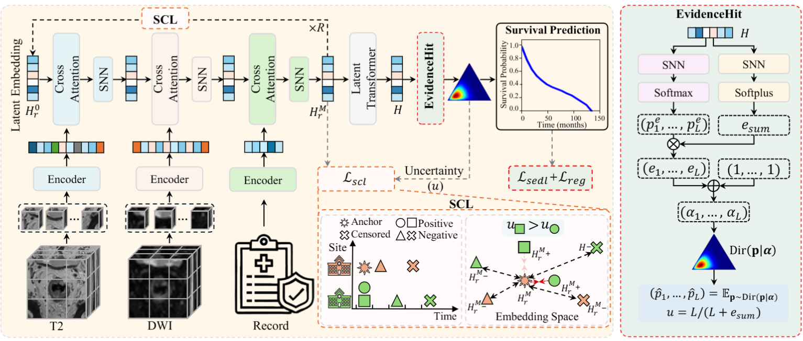

# UICSurv: Uncertainty-aware Multimodal Survival Prediction for Rectal Cancer

This repository contains the official implementation of **UICSurv**, a novel multimodal survival prediction framework designed for rectal cancer prognosis.  

## 🖼️ Framework Overview

The overall framework of **UICSurv** is illustrated below:

  

UICSurv enhances **robustness** and **interpretability** by addressing both **modality heterogeneity** and **site heterogeneity** through:
- Iterative cross-attention based multimodal fusion (backbone from **HEALNET**).  
- **Survival Contrastive Learning (SCL)** for semantic-preserving embedding.  
- **EvidenceHit**: uncertainty-aware survival prediction module with evidence learning.  

---

## 🚀 Key Features
- Multimodal survival prediction with **uncertainty estimation**.  
- **Cross-site evaluation** to ensure robustness and generalization.  
- Support for **Kaplan–Meier (KM) analysis**.  

---

## 🔗 References
- **HEALNET**: [https://github.com/konst-int-i/healnet](https://github.com/konst-int-i/healnet)

## 📫 Contact
- Email: senlinbao@gmail.com
